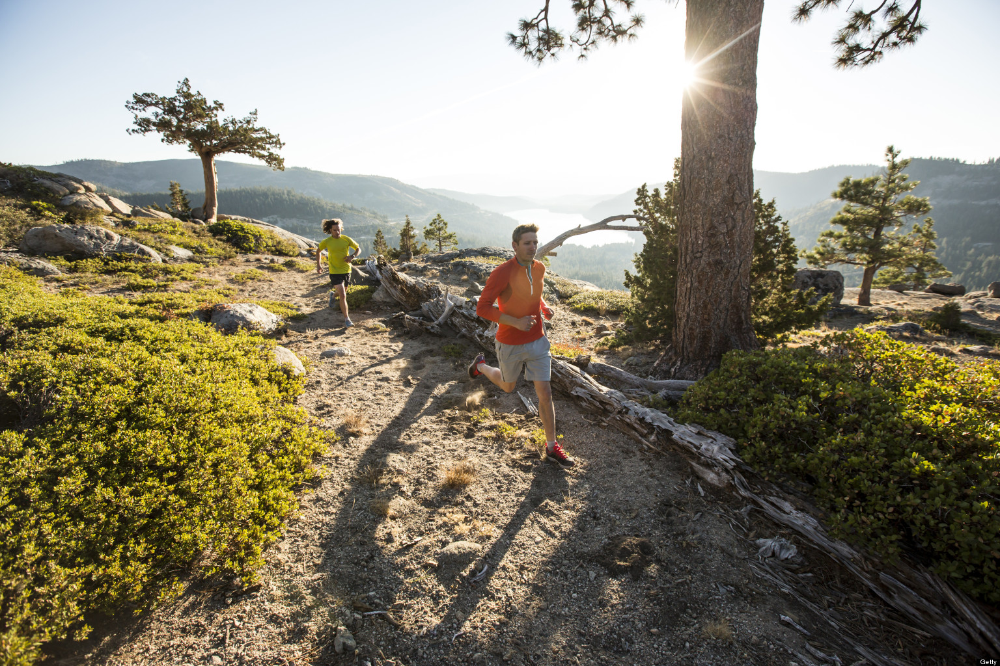

## Product Category:
#### Sports & Outdoor Reviews


<br>

### Dataset:
Utilized _AWS_ for storage and quick access of data:

<br>


<br>

Source :
UCSanDiego library/repo Curated by Julian McAuley
[[ Link ]](http://jmcauley.ucsd.edu/data/amazon/)

_Dataset size_:
296,337 x 10 [ rows x columns ]

| Column headers | description                      |
| -------------- | -------------------------------  |
|  asin          |  Product ID                      |
|  summary       |  Title of review                 |
|  reviewText    |  Written review                  |
|  overall       |  Rating 1-5 (stars)              |
|  reviewerID    |  Reviewer ID                     |
|  reviewerName  |  Person's name (no standard format)  |
|  helpful       |  Helpfulness rating of the review    |
|  reviewTime    |  YYYY-MM--DD                     |
|  unixReviewTime|  Time of the review (unix time)  |
|  pos_neg       |  (1) Positive for 4-5 or (2) Negative for 1-3 Overall rating  |


# Project Outline:

<u>Business motivation</u> :  
For ecommerce sites and outfitters to stay competitive and innovate, they must be able to draw and hold dedicated customers. One particularly effective approach in recent years has been to build personalized recommendation engines into their platform or interface. Determining the specific topics and sentiments associated with given sports and outdoors products is essential in building a recommendation engine. This project is mainly to understand the concepts covered in class and apply them to a specific domain.

<u>Problem formulation</u> :

1. Explore and Process the data in order to glean basic insights about the data and prep to utilize models

2. Finding a classification model that works best with the data.

3. Understanding the topics and words that describe the broad categories of Sports and Outdoors product sold over Amazon.

4. Given the data and model performance, determine what is the best course of actions going forward.

## Approach:

* EDA

* Preprocessing

* Model data
    1. Classification / Sentiment Analysis
        * Logistic Regression
        * Multinomial Naive Bayes

    2. Clustering / Topic Modeling
        * Nonnegative Matrix Factorization (NMF)
        * Latent Dirichlet Allocation (Lda)

* Summarize Findings and Proposed Further Work


### Conclusion:
- The data appears to be surprisingly quite biased and imbalanced toward Shooting sports. Since this group of activities was not going to be a main focus in the end product, more and different data is needed to build an appropriate model for the end goal.

- Aside for the data itself, here is a summary of the modeling results:

```
Classification Summary:
* Logistic Regression (using CountVectorizer) performance was the best with - F1 score: 94 %.
* Multinomial NB with Tfidf was a close second with - F1 score: 92 %.

Clustering Summary:
* Both NMF and Lda with term frequency were about the same and just ok.
* NMF with Tfidf was the best with no obscure topics and the model even correctly associated a topic of words with a specific brand (Nalgene).
* Lda with Tfidf primarily retrieved unassociated words; however, it did return the most specific and unique words out of them all (i.e. brand news)
```

####  Further work:

- Build a web scraper utilizing <i>Beautiful Soup</i> to gather more appropriate, unbiased reviews from a sports outlet like [ <b>REI</b> ](https://www.rei.com/) or [ Dick's Sporting Goods ](http://www.dickssportinggoods.com/home/index.jsp?ab=Header_DicksLogo).

- Focus on categorizing by Sports and Outdoor activities in order to build better classification model that excludes Shooting sports

- Incorporate word2vec or LDA2vec
